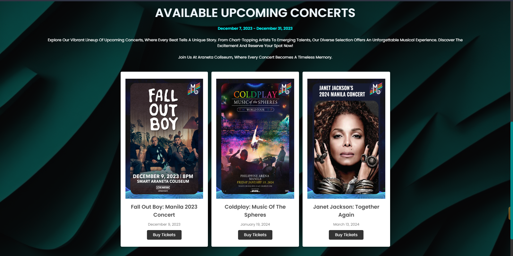
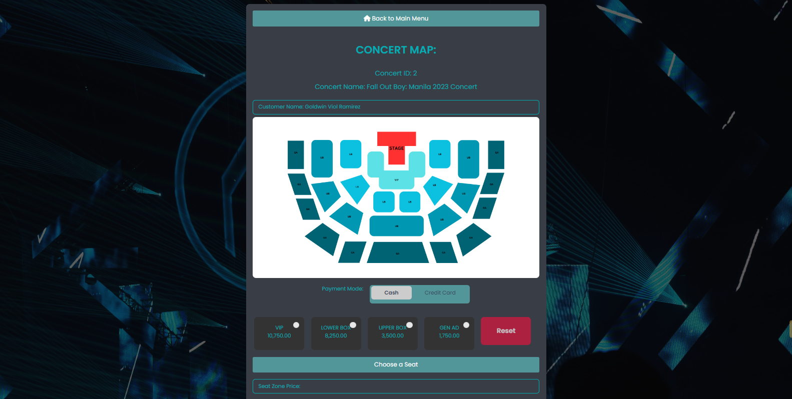
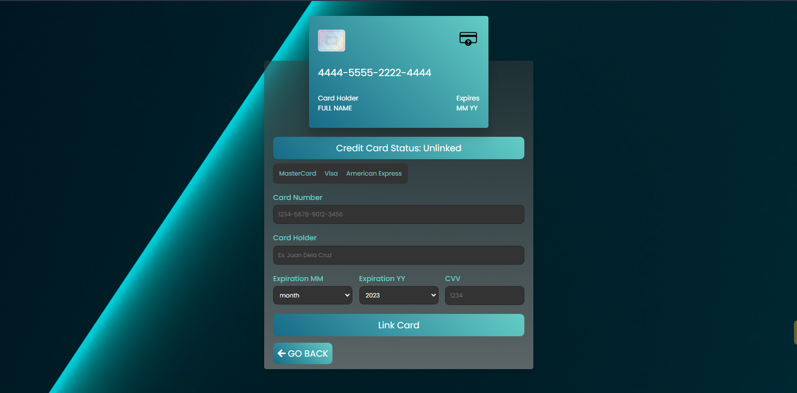
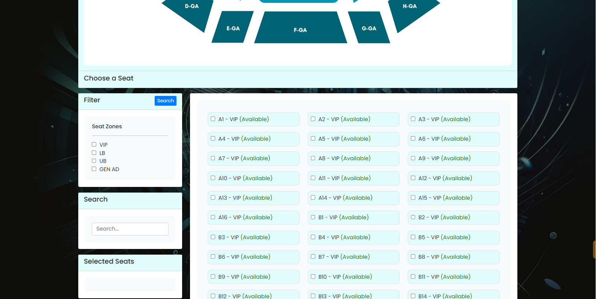
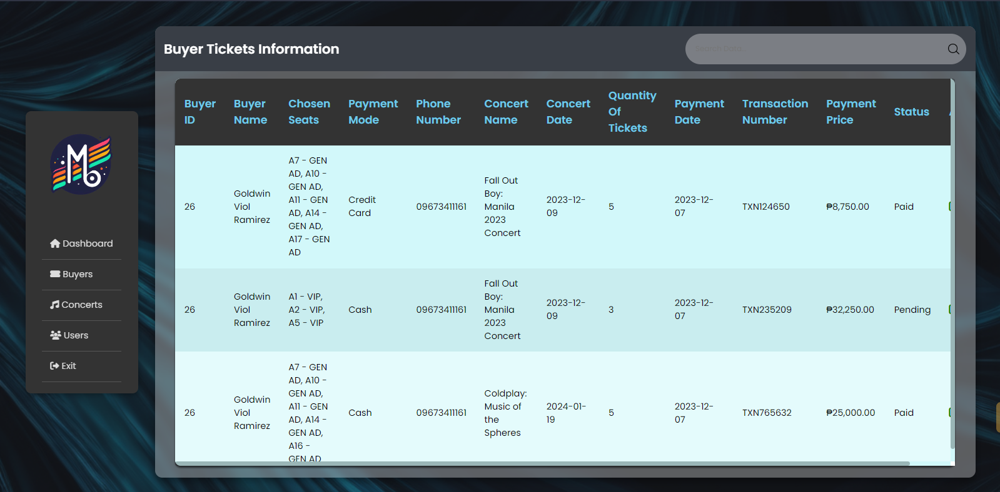

# MUSIVERSE: Online Concert Ticketing System

For both organizers and fans, online concert tickets streamline the entire ticket- purchasing process. It saves time and effort by taking away the necessity for people to travel to ticket booths and allows them to easily purchase tickets from the comfort of their homes or while on the go. Online platforms have simple user interfaces that allow clients to browse available selections of desired seating arrangements. Using secure payment systems increases the security of transactions, reduces fraud risk, and ensures a safe and easy ticket purchase process. Moreover, organizers gain from easier handling of events and quick access to information about ticket sales, which helps them plan their marketing.

# Programming Languages and Database Used

MySQL and PHP work well together to create webpages. The relational database administration system MySQL and the server-side scripting language PHP work together perfectly to help programmers create websites and apps. PHP provides dynamic content for a more interactive user experience by running code on the server side. MySQL serves as the backend database in between effectively handling and storing data. Together, these enable developers to create full of features websites with complex database-driven capabilities, user authentication, and dynamic content. Because both MySQL and PHP are free software with strong documentation and community support, web developers looking for scalability and flexibility in creating powerful and effective online applications may easily choose them.

# Sample Screenshots

### Splash Page

### Home Page

### Seats Page

### Payment Configuration Page

### Seats Configuration Page

### Admin Dashboard Page

If you have any inquiries please feel free to reach me at personal email: cjohneriel@gmail.com

